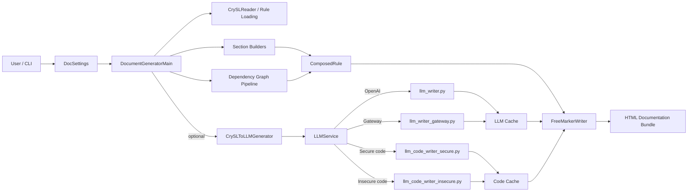
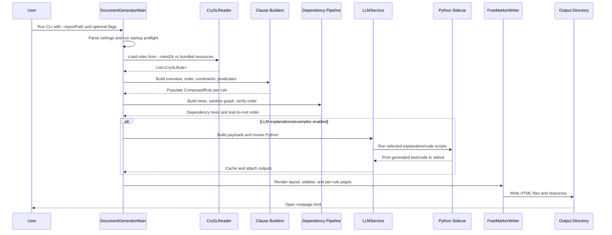
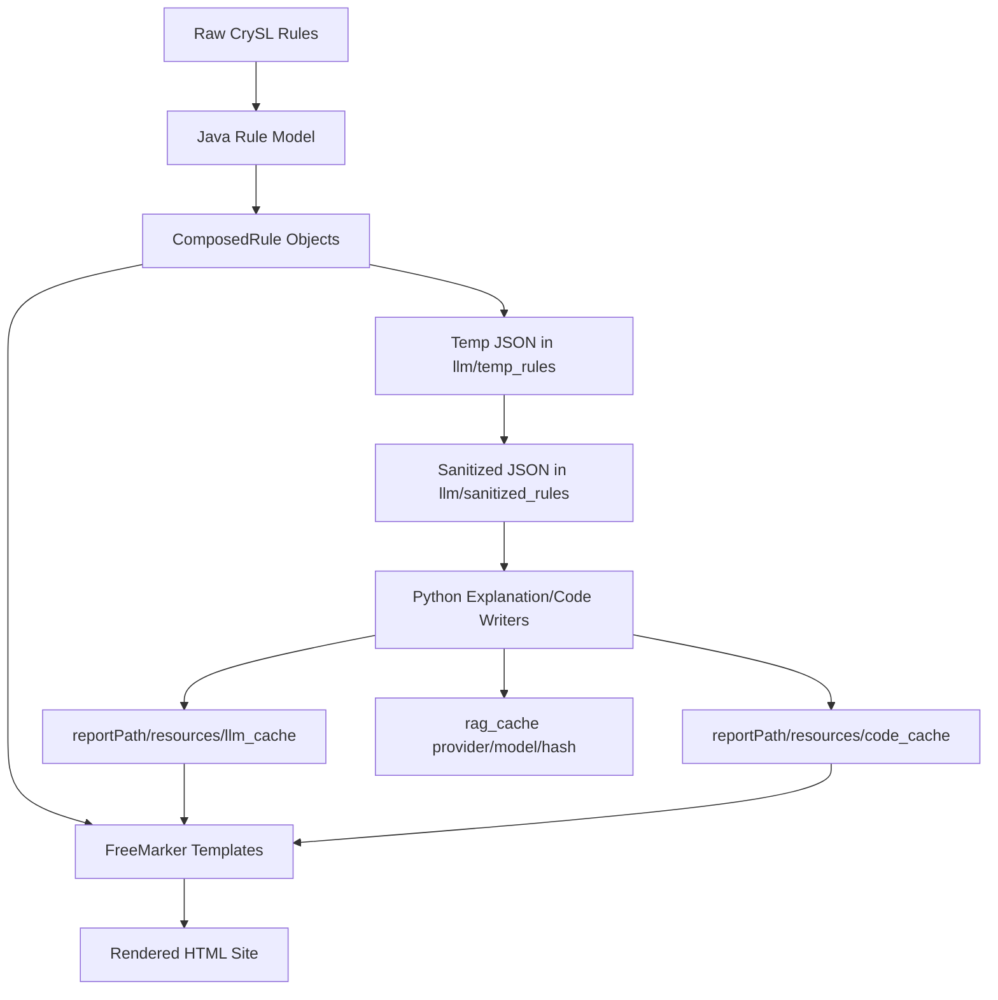

# FINAL DOCUMENTATION: CogniCrypt_DOC_LLM

**Status:** Authoritative consolidation of the current working tree  
**Scope:** Java pipeline, Python sidecar, bundled resources, generated artifacts, docs, tooling, and repository layout  
**Source of truth:** Current repository state, reconciled against the documentation set in `Docs/`  
**Date:** 2026-04-14

---

## Table of Contents

1. [Introduction](#introduction)
2. [Problem Statement](#problem-statement)
3. [Proposed Solution](#proposed-solution)
4. [Architecture](#architecture)
   1. [System Overview](#system-overview)
   2. [End-to-End Execution Flow](#end-to-end-execution-flow)
   3. [Data, Cache, and Artifact Flow](#data-cache-and-artifact-flow)
5. [Implementation](#implementation)
   1. [Build, Runtime, and Environment Requirements](#build-runtime-and-environment-requirements)
   2. [Java Orchestration Layer](#java-orchestration-layer)
   3. [Rule Ingestion and Resource Loading](#rule-ingestion-and-resource-loading)
   4. [Natural-Language Section Generation](#natural-language-section-generation)
   5. [Dependency Graph and Tree Pipeline](#dependency-graph-and-tree-pipeline)
   6. [Java-Python LLM Boundary](#java-python-llm-boundary)
   7. [Explanation Generation Pipeline](#explanation-generation-pipeline)
   8. [Secure and Insecure Code Generation Pipeline](#secure-and-insecure-code-generation-pipeline)
   9. [Rendering and Frontend Behavior](#rendering-and-frontend-behavior)
   10. [Configuration Surface](#configuration-surface)
   11. [Testing and Tooling](#testing-and-tooling)
6. [Results](#results)
   1. [What a Successful Run Produces](#what-a-successful-run-produces)
   2. [Validation Performed on the Current Workspace](#validation-performed-on-the-current-workspace)
   3. [Current Repository Observations](#current-repository-observations)
7. [Code Base Deep Dive](#code-base-deep-dive)
   1. [Repository Structure Layout](#repository-structure-layout)
   2. [Top-Level Directory Responsibilities](#top-level-directory-responsibilities)
   3. [Java Codebase Deep Dive](#java-codebase-deep-dive)
   4. [Python Codebase Deep Dive](#python-codebase-deep-dive)
   5. [Resources, Templates, and Rules](#resources-templates-and-rules)
   6. [Generated Outputs, Caches, and Archives](#generated-outputs-caches-and-archives)
8. [Documentation Reconciliation](#documentation-reconciliation)
9. [Risks, Limitations, and Fragile Spots](#risks-limitations-and-fragile-spots)
10. [Conclusion](#conclusion)

---

## Introduction

`CogniCrypt_DOC_LLM` is a documentation-generation system for cryptographic API usage rules written in **CrySL**. The repository combines a **Java-driven rule-processing and HTML-rendering pipeline** with an **optional Python LLM sidecar** for multilingual explanations and secure/insecure Java code examples.

The project takes formal secure-usage specifications for Java cryptographic APIs and turns them into a browsable documentation site. The generated output is meant to bridge the gap between rule-level formalism and developer-facing guidance.

At a high level, the system performs four jobs:

1. Load CrySL rules and related template resources.
2. Convert each rule into structured, human-readable documentation sections.
3. Optionally enrich those sections with LLM-generated explanations and code examples.
4. Render the final HTML site using FreeMarker templates.

This document supersedes the fragmented documentation set in `Docs/` by consolidating the current repository state into a single, updated, exhaustive reference.

---

## Problem Statement

CrySL rules are expressive and precise, but they are not naturally optimized for day-to-day developer consumption.

The core problem the project addresses is:

- CrySL specifications are formal and structurally rich, but difficult to read as practical guidance.
- Correct cryptographic API usage often depends on call order, parameter constraints, predicates, and inter-class dependencies.
- Developers typically need an explanation in plain language, not raw rule syntax.
- Manual documentation for a large set of crypto APIs is expensive to maintain and easily drifts from the formal source.
- Purely generated reference text is useful but can still be too dry or too formal for onboarding and educational use.

In practical terms, the repository solves the mismatch between:

- **formal security contracts** as the source of truth, and
- **developer-friendly documentation** as the format needed for real adoption.

---

## Proposed Solution

The repository implements a layered solution:

1. **Java as the primary orchestrator**
   - Parse CLI input.
   - Load CrySL rules.
   - Build a per-rule intermediate model.
   - Compute dependency trees and dependency order.
   - Render final HTML pages.

2. **Specialized section builders for CrySL semantics**
   - Convert ORDER, constraints, predicates, and forbidden usage into readable text.
   - Use reusable language templates from `src/main/resources/Templates/`.

3. **Optional Python LLM sidecar**
   - Generate multilingual explanations.
   - Generate secure Java examples grounded in the CrySL contract.
   - Generate insecure contrast examples.
   - Use report-scoped caches to avoid unnecessary recomputation.

4. **Static HTML output via FreeMarker**
   - Produce a browsable documentation bundle with navigation, class pages, dependency trees, CrySL rule display, and LLM-enriched sections.

The important design choice is that **CrySL remains the authoritative contract**, while generated natural-language and LLM content are layered on top of it for usability.

---

## Architecture

### System Overview

The project has two runtime halves:

- **Java pipeline**: source of orchestration, rule processing, dependency analysis, cache ownership, and HTML rendering.
- **Python pipeline**: optional enrichment layer for LLM explanations, code examples, PDF-based grounding, and gateway/OpenAI integration.



### End-to-End Execution Flow



### Data, Cache, and Artifact Flow



---

## Implementation

### Build, Runtime, and Environment Requirements

#### Java and Maven

The project targets **Java 21**, not Java 17 or lower.

Key evidence in the current repository:

- `pom.xml` compiles with `release 21`.
- `run_crysldoc.sh` explicitly exports `JAVA_HOME=/usr/lib/jvm/java-21-openjdk-amd64`.
- local validation showed that plain `mvn test` fails under Java 17, while the same command succeeds when `JAVA_HOME` is pinned to Java 21.

#### Python

Python is required only for LLM features. The runtime dependencies include:

- `openai`
- `faiss-cpu`
- `pypdf`
- `python-dotenv`
- `numpy`
- `pytest`

#### Core Build Artifacts

The Maven build produces:

- `target/DocGen-0.0.1-SNAPSHOT.jar`
- `target/lib/` runtime dependencies
- `target/generated-resources/JavaCryptographicArchitecture/` unpacked external ruleset ZIP contents

#### External Configuration

The live configuration surface includes:

- `OPENAI_API_KEY`
- `OPENAI_CHAT_MODEL`
- `OPENAI_EMB_MODEL`
- `GATEWAY_API_KEY`
- `GATEWAY_BASE_URL`
- `GATEWAY_CHAT_MODEL`
- `GATEWAY_EMB_MODEL`
- `GATEWAY_RPM`
- `CRYSLDOC_COMPILE_CHECK`
- `CRYSLDOC_COMPILE_STRICT`
- `CRYSLDOC_JAVAC_REQUIRED`
- `CRYSLDOC_MAX_REPAIRS`
- `JAVAC_BIN`

### Java Orchestration Layer

The Java pipeline is centered on `src/main/java/de/upb/docgen/DocumentGeneratorMain.java`.

Its responsibilities are:

- parse and validate CLI flags through `DocSettings`
- ensure critical classes are on the classpath
- load CrySL rules from disk or bundled resources
- build one `ComposedRule` per CrySL rule
- compute dependency trees and dependency order
- invoke LLM explanation and code-generation flows if enabled
- manage report-scoped cache directories
- render the final HTML site
- optionally copy `.crysl` files into the output bundle

`DocSettings` is implemented as a singleton. It controls:

- report path
- override paths for rules and templates
- feature toggles `A` through `G`
- explanation and example enablement
- backend selection (`openai` or `gateway`)

A notable detail is that several boolean flags are **inversion flags**: they default to enabled behavior and are set to `false` when passed.

### Rule Ingestion and Resource Loading

Rule/resource ingestion is handled by `CrySLReader` and the surrounding Java logic.

The current behavior is:

- if `--rulesDir` is set, rules are loaded from that directory
- otherwise bundled resources under `src/main/resources/CrySLRules/` are used

`CrySLReader` supports:

- IDE/file mode, where resources are ordinary files
- packaged JAR mode, where resources are extracted into a temporary directory and parsed from there

It also loads:

- FreeMarker templates from `FTLTemplates/`
- `Templates/symbol.properties`
- single rule files on demand for raw CrySL display and optional rule export

An important architectural point is that the repository currently contains **two rule corpora**:

- the active runtime rules under `src/main/resources/CrySLRules/`
- the build-unpacked rules under `target/generated-resources/JavaCryptographicArchitecture/`

The default runtime path uses the bundled resource copy, not the unpacked build copy.

### Natural-Language Section Generation

For each CrySL rule, Java creates a `ComposedRule`, which acts as the central per-class documentation object.

The natural-language generation path is not generic text synthesis. It is a family of specialized rule translators:

- `ClassEventForb.java`
  - class identity text
  - JavaDoc links
  - method/event count summary
  - forbidden-method sentences
- `Order.java`
  - direct parsing of raw `.crysl` text
  - EVENT label resolution
  - ORDER regular-expression symbol translation through `symbol.properties`
- `ConstraintsVc.java`
  - value constraints
- `ConstraintsPred.java`
  - predicate constraints with cross-class references
- `ConstraintsComparison.java`
  - arithmetic/comparison constraints
- `ConstraintCrySLVC.java`
  - implication/value-constraint clauses
- `ConstraintCryslnocallto.java`
  - `noCallTo(...)` clauses
- `ConstraintCrySLInstanceof.java`
  - `instanceof`-based constraints
- `ConstraintCrySLandencmode.java`
  - mixed encmode/value-constraint cases
- `Ensures.java`
  - ensures predicates involving `this`
- `EnsuresCaseTwo.java`
  - ensures predicates involving return values or non-`this` parameters
- `Negates.java`
  - negated predicates

These classes rely heavily on string processing, CrySL AST interrogation, and the language templates stored under `src/main/resources/Templates/`.

### Dependency Graph and Tree Pipeline

The repository models cross-class CrySL dependencies through predicate relationships.

The pipeline works like this:

1. Build class-to-ensures and class-to-requires maps.
2. Use `Utils.mapPredicates(...)` to connect provider and consumer rule relationships.
3. Reduce predicate mappings to class-name adjacency via `Utils.toOnlyClassNames(...)`.
4. Build dependency trees for template rendering via `PredicateTreeGenerator.buildDependencyTreeMap(...)`.
5. For each rule:
   - sanitize the graph with `GraphSanitizer.sanitize(...)`
   - verify ordering with `GraphVerification.verifyOrdering(...)`
   - compute a stable leaf-to-root dependency order through `Utils.leafToRootOrderTopo(...)`

This produces two different dependency views:

- a **tree view** for the UI
- a **flat leaf-to-root dependency order** for explanation/code-generation context

The graph logic includes heuristics for self-loop removal, reachable-subgraph filtering, and SCC collapse/expansion. That improves stability but also introduces some non-trivial behavior under cyclic dependency conditions.

### Java-Python LLM Boundary

Java does not directly call model APIs. It invokes Python scripts through subprocesses.

The bridge is implemented by:

- `CrySLToLLMGenerator.java`
- `LLMService.java`
- `Utils.sanitizeRuleFileSecure(...)`
- `CachePathResolver.java`

The contract is filesystem-based:

- Java writes temp JSON payloads under `llm/`
- Python reads those files and prints output to stdout
- Java captures stdout, caches it, and injects it into the final render model

The explanation path writes:

- `llm/temp_rules/temp_rule_<fqcn>_<lang>.json`
- `llm/sanitized_rules/sanitized_rule_<fqcn>_<lang>.json`

The example path writes:

- `llm/temp_example_secure.json`
- `llm/temp_example_insecure.json`

A critical implementation detail is that `LLMService` merges stderr into stdout using `redirectErrorStream(true)`. That means warnings or debug lines emitted by Python can become part of the cached explanation or example text if the process exits successfully.

### Explanation Generation Pipeline

Explanations are generated by one of two Python entrypoints:

- `llm/llm_writer.py` for OpenAI
- `llm/llm_writer_gateway.py` for the UPB gateway

Both delegate most shared logic to `llm/utils/writer_core.py`.

The explanation pipeline does the following:

1. Accept a fully qualified class name and target language.
2. Resolve the corresponding `.crysl` file by simple class name.
3. Load or build optional RAG context from `tse19CrySL.pdf`.
4. Parse raw CrySL sections.
5. Load the sanitized JSON for the rule and for dependency-related rules.
6. Build a strict prompt with exact markdown section headings.
7. Call the selected backend.
8. Clean the model output and print it to stdout.

The current explanation languages are fixed to:

- English
- Portuguese
- German
- French

The prompt contract expects headings like:

- `## Overview`
- `## Correct Usage`
- `## Parameters and Constraints`
- `## Method Variations and Use Cases`
- `## Security Requirements`
- `## Related Components & Their Guarantees`
- `## Common Mistakes to Avoid`
- `## Quick Reference Checklist`

This is important because the frontend later renders these outputs as markdown.

### Secure and Insecure Code Generation Pipeline

The code-generation layer is split deliberately into two different behaviors.

#### Secure Writer

`llm/llm_code_writer_secure.py` is the more complex path. It:

1. loads the JSON payload and target class name
2. resolves backend-specific client and model settings
3. reconstructs an **authoritative CrySL contract** from the raw `.crysl` file
4. shapes that contract to bounded prompt size
5. loads dependency constraints and ensures from sanitized JSON
6. loads a cached or generated CrySL primer from the PDF/RAG layer
7. prompts the model for one self-contained Java file
8. normalizes imports and class naming
9. compiles the result with `javac`
10. if compilation fails, enters a repair loop using compiler diagnostics
11. exits only with compilable code or a hard error

The compile-and-repair loop is controlled by environment variables and uses:

- `--compile-classpath`
- `--java-release`
- `JAVAC_BIN`
- `CRYSLDOC_MAX_REPAIRS`

#### Insecure Writer

`llm/llm_code_writer_insecure.py` intentionally generates misuse examples for comparison. It:

- uses the payload fields directly in the prompt
- asks the model to violate the CrySL rule intentionally
- prints output to stdout
- does **not** compile-validate or repair the result

This asymmetry is intentional but materially affects output guarantees.

### Rendering and Frontend Behavior

Final rendering happens in `FreeMarkerWriter.java`, using the templates under `src/main/resources/FTLTemplates/`.

The output bundle contains:

- `rootpage.html`
- `frontpage.html`
- `navbar.html`
- `crysl.html`
- `composedRules/*.html`

The main per-class page is driven by `singleclass.ftl` and includes:

- overview
- order
- constraints
- predicates
- requires tree
- ensures tree
- LLM explanation section with language selector
- secure and insecure code examples
- raw CrySL rule display
- state-machine graph visualization

Browser-side behavior currently depends on CDN-hosted JavaScript libraries for:

- `d3`
- `@hpcc-js/wasm`
- `d3-graphviz`
- `marked`

The template escapes raw explanation text initially, then converts markdown client-side with `marked.parse(...)`. This improves readability but also means LLM-produced markdown becomes browser-rendered HTML.

### Configuration Surface

#### Required CLI Flag

- `--reportPath <output_dir>`

#### Optional Input/Template Overrides

- `--rulesDir <path>`
- `--ftlTemplatesPath <path>`
- `--langTemplatesPath <path>`

#### UI and Content Toggle Flags

- `--booleanA` hide state machine graph
- `--booleanB` hide help button/sections
- `--booleanC` hide dependency tree sections
- `--booleanD` hide raw CrySL rule section
- `--booleanE` documented legacy toggle with no visible effect in the active template path
- `--booleanF` copy CrySL rules into `<reportPath>/rules/`
- `--booleanG` switch Graphviz label rendering behavior

#### LLM Control Flags

- `--disable-llm-explanations`
- `--disable-llm-examples`
- `--llm=<on|off|true|false|1|0>`
- `--llm-explanations=<on|off|true|false|1|0>`
- `--llm-examples=<on|off|true|false|1|0>`
- `--llm-backend=<openai|gateway>`

#### Report-Scoped Cache Directories

- `<reportPath>/resources/llm_cache`
- `<reportPath>/resources/code_cache`

### Testing and Tooling

The current automated test surface is intentionally small.

#### Java Tests

- `src/test/java/de/upb/docgen/utils/CachePathResolverTest.java`
  - verifies report-path normalization and cache-directory resolution

#### Python Tests

- `llm/tests/test_delete_disabled_code_cache_files.py`
  - verifies cleanup behavior for placeholder cache files

#### Helper Scripts and Runtime Tooling

- `run_crysldoc.sh`
  - CLI equivalent of the IDE run path
  - hard-pins Java 21
- `scripts/delete_disabled_code_cache_files.py`
  - removes placeholder outputs from code and explanation caches

#### IDE Metadata

The repository also carries local project metadata for:

- IntelliJ
- Eclipse
- VS Code

These are environment aids, not core runtime logic.

---

## Results

### What a Successful Run Produces

A successful run generates a self-contained documentation bundle rooted at the configured `--reportPath`.

Typical contents:

- `rootpage.html` as the entry point
- `frontpage.html` and `crysl.html` as supporting static pages
- `navbar.html` for navigation/search
- `composedRules/*.html` for one page per CrySL rule/class
- `resources/llm_cache/*.txt` for explanation caches
- `resources/code_cache/*.txt` for secure/insecure example caches
- `resources/code_cache/llm_codegen_failures.txt`
- optional `rules/*.crysl` export when the copy-rules flag path is enabled

### Validation Performed on the Current Workspace

The current repository state was validated non-destructively with the following results:

- `JAVA_HOME=/usr/lib/jvm/java-21-openjdk-amd64 mvn -q test` -> passed
- `pytest -q` -> passed (`3 passed`)
- plain `mvn test` -> fails under the current default Java 17 environment because the project requires Java 21
- offline end-to-end generation with `--llm=off` -> succeeded and produced the expected documentation structure

The offline end-to-end run confirmed that the core Java pipeline is functional even when the LLM layer is disabled.

### Current Repository Observations

The current working tree contains the following live/generated metrics:

- 51 bundled CrySL rules
- 52 language-template files
- 6 FreeMarker templates
- 31 Java source files
- 14 Python source files
- 204 sanitized explanation JSON files
- 204 temp explanation JSON files
- 51 generated class pages in `Output/composedRules/`
- 204 explanation cache files in `Output/resources/llm_cache/`
- 103 code-cache text files in `Output/resources/code_cache/`

The repository also currently contains ignored/generated output and cache directories such as:

- `Output/`
- `rag_cache/`
- `llm/sanitized_rules/`
- `llm/temp_rules/`
- `target/`

---

## Code Base Deep Dive

### Repository Structure Layout

The following layout reflects the actual working tree, compressed to the important runtime and documentation areas.

```text
CogniCrypt_DOC_LLM/
├── Docs/
│   ├── README.md
│   ├── project.md
│   ├── java.md
│   ├── python.md
│   ├── ANALYSIS.md
│   ├── PROJECT_GUIDE.md
│   ├── PROJECT_FULL_GUIDE.md
│   ├── PROJECT_FULL_GUIDE_V2.md
│   ├── UPB_AI_Gateway_Migration_Guide.md
│   ├── code_review_ollama_gateway_assessment.md
│   ├── diff.md
│   ├── PR_JAVA_REVIEW.md
│   ├── JAVA_REVIEW_NATURAL.md
│   ├── JAVA_PR_REVIEW_SIMPLIFIED.md
│   └── FILES.md
├── llm/
│   ├── llm_writer.py
│   ├── llm_writer_gateway.py
│   ├── llm_code_writer_secure.py
│   ├── llm_code_writer_insecure.py
│   ├── paper_index.py
│   ├── paper_index_gateway.py
│   ├── utils/
│   │   ├── writer_core.py
│   │   ├── llm_utils.py
│   │   ├── rag_index_common.py
│   │   ├── llm_env.py
│   │   └── gateway_rate_limit.py
│   ├── tests/
│   │   └── test_delete_disabled_code_cache_files.py
│   ├── sanitized_rules/          # generated/cache, 204 files in current tree
│   ├── temp_rules/               # generated/cache, 204 files in current tree
│   ├── temp_example_secure.json
│   └── temp_example_insecure.json
├── scripts/
│   └── delete_disabled_code_cache_files.py
├── src/
│   ├── main/
│   │   ├── java/de/upb/docgen/
│   │   │   ├── DocumentGeneratorMain.java
│   │   │   ├── DocSettings.java
│   │   │   ├── ComposedRule.java
│   │   │   ├── ClassEventForb.java
│   │   │   ├── Order.java
│   │   │   ├── Constraints*.java
│   │   │   ├── Ensures*.java
│   │   │   ├── Negates.java
│   │   │   ├── FunctionUtils.java
│   │   │   ├── crysl/CrySLReader.java
│   │   │   ├── graphviz/StateMachineToGraphviz.java
│   │   │   ├── llm/
│   │   │   │   ├── CrySLToLLMGenerator.java
│   │   │   │   └── LLMService.java
│   │   │   ├── utils/
│   │   │   │   ├── CachePathResolver.java
│   │   │   │   ├── GraphSanitizer.java
│   │   │   │   ├── GraphVerification.java
│   │   │   │   ├── PredicateTreeGenerator.java
│   │   │   │   ├── TemplateAbsolutePathLoader.java
│   │   │   │   ├── TreeNode.java
│   │   │   │   ├── Utils.java
│   │   │   │   ├── FTLTemplateLoaderFromJar.java
│   │   │   │   └── Constant.java
│   │   │   └── writer/FreeMarkerWriter.java
│   │   ├── java/de/upb/userstudy/StringEncryption.java
│   │   └── resources/
│   │       ├── CrySLRules/       # 51 rules
│   │       ├── Templates/        # 52 clause templates and symbol.properties
│   │       └── FTLTemplates/     # 6 HTML templates
│   └── test/java/de/upb/docgen/utils/CachePathResolverTest.java
├── pom.xml
├── requirements.txt
├── run_crysldoc.sh
├── Output/                       # ignored/generated documentation bundle
├── rag_cache/                    # ignored/generated RAG cache
├── target/                       # ignored/generated Maven output
├── latest_doc.zip                # historical archive
├── Output_OPENAI.zip             # historical archive
├── interview_study/              # historical archive area
└── tse19CrySL.pdf                # CrySL paper for RAG/primer use
```

### Top-Level Directory Responsibilities

| Path | Role | Notes |
|---|---|---|
| `src/` | Primary runtime code and resources | Main Java implementation and bundled assets |
| `llm/` | Python LLM sidecar | Explanations, codegen, RAG, env, throttling |
| `scripts/` | Operational helper scripts | Cache cleanup utility |
| `Docs/` | Repository documentation corpus | Mixed current, historical, and review docs |
| `Output/` | Generated documentation snapshot | Ignored/generated local artifact |
| `rag_cache/` | Retrieval cache | Ignored/generated local artifact |
| `target/` | Maven build output | Ignored/generated local artifact |
| `.github/` | Local planning artifacts in current tree | No active GitHub Actions workflows present |
| `latest_doc.zip`, `Output_OPENAI.zip`, `interview_study/` | Historical archives | Useful as snapshots, not active runtime inputs |

### Java Codebase Deep Dive

#### Core Orchestration and Configuration

- `DocumentGeneratorMain.java`
  - top-level orchestration pipeline
  - LLM enablement, cache coordination, HTML rendering, rule export
- `DocSettings.java`
  - singleton CLI/settings store
  - parses all runtime flags and backend selection
- `ComposedRule.java`
  - central per-rule DTO used by the render layer

#### Rule-to-Text Builders

- `ClassEventForb.java`
- `Order.java`
- `ConstraintsVc.java`
- `ConstraintsPred.java`
- `ConstraintsComparison.java`
- `ConstraintCrySLVC.java`
- `ConstraintCryslnocallto.java`
- `ConstraintCrySLInstanceof.java`
- `ConstraintCrySLandencmode.java`
- `Ensures.java`
- `EnsuresCaseTwo.java`
- `Negates.java`
- `FunctionUtils.java`

These are the semantic translation layer. They turn CrySL rule structure into developer-facing text.

#### Resource Loading and Rendering Support

- `crysl/CrySLReader.java`
  - filesystem vs JAR resource loading
- `writer/FreeMarkerWriter.java`
  - final HTML rendering
- `graphviz/StateMachineToGraphviz.java`
  - DOT graph generation from CrySL usage patterns
- `utils/TemplateAbsolutePathLoader.java`
  - absolute-path template loading for FreeMarker overrides

#### LLM Bridge

- `llm/CrySLToLLMGenerator.java`
  - builds payloads for explanation and example generation
- `llm/LLMService.java`
  - Python process execution, cache handling, env/argument bridging

#### Graph and Utility Layer

- `utils/CachePathResolver.java`
  - report-scoped cache directory resolution
- `utils/GraphSanitizer.java`
  - graph cleanup and SCC handling
- `utils/GraphVerification.java`
  - sanity-check ordering validation
- `utils/PredicateTreeGenerator.java`
  - requires/ensures tree construction
- `utils/TreeNode.java`
  - tree node model used in rendering
- `utils/Utils.java`
  - large shared helper class; includes JSON sanitization, predicate mapping, template access, and topo ordering
- `utils/FTLTemplateLoaderFromJar.java`
  - legacy/alternate helper, not in the main render path
- `utils/Constant.java`
  - legacy utility path, low visibility in the active flow

#### Non-Pipeline Java File

- `de/upb/userstudy/StringEncryption.java`
  - example/demo code, not part of the documentation-generation pipeline

### Python Codebase Deep Dive

#### Explanation Writers

- `llm_writer.py`
  - OpenAI-backed explanation entrypoint
- `llm_writer_gateway.py`
  - gateway-backed explanation entrypoint
- `utils/writer_core.py`
  - shared explanation control plane and prompt contract
- `utils/llm_utils.py`
  - sanitized-file loading, CrySL parsing, dependency formatting, output cleanup

#### Code Writers

- `llm_code_writer_secure.py`
  - secure example generation with compile-and-repair loop
- `llm_code_writer_insecure.py`
  - insecure contrast example generation without compile validation

#### Retrieval / RAG Layer

- `paper_index.py`
  - OpenAI embedding-based index creation
- `paper_index_gateway.py`
  - gateway embedding-based index creation
- `utils/rag_index_common.py`
  - shared FAISS abstraction, chunking, and cache persistence contract

#### Backend Environment and Throttling

- `utils/llm_env.py`
  - `.env` loading and backend defaults
- `utils/gateway_rate_limit.py`
  - cross-process RPM limiter using state and lock files under `llm/`

#### Testing and Support

- `tests/test_delete_disabled_code_cache_files.py`
  - tests for placeholder cleanup behavior
- `scripts/delete_disabled_code_cache_files.py`
  - report/cache cleanup helper script

### Resources, Templates, and Rules

#### Bundled CrySL Rules

`src/main/resources/CrySLRules/` contains the bundled rule corpus used by default runtime execution.

Current count: **51 rules**.

#### Language Templates

`src/main/resources/Templates/` contains template fragments used by the Java clause-builder layer.

Current count: **52 files**.

This includes `symbol.properties`, which is especially important for `Order.java` because it translates CrySL ORDER symbols into readable phrases.

#### FreeMarker Templates

`src/main/resources/FTLTemplates/` contains the HTML rendering templates.

Current count: **6 files**.

Active templates in the render path:

- `frontpage.ftl`
- `rootpage.ftl`
- `crysl.ftl`
- `sidebar.ftl`
- `singleclass.ftl`

Present but not currently referenced by the active Java render path:

- `header.ftl`

### Generated Outputs, Caches, and Archives

#### Output Bundle

`Output/` in the current tree is a generated snapshot and includes:

- 51 per-rule HTML pages under `Output/composedRules/`
- shared layout files
- explanation caches
- code caches

#### LLM Intermediate Files

`llm/temp_rules/` and `llm/sanitized_rules/` are live bridge/cache directories used by the explanation pipeline.

Current counts:

- `temp_rules/`: 204 JSON files
- `sanitized_rules/`: 204 JSON files

The cardinality matches 51 rules x 4 languages.

#### RAG Cache

`rag_cache/` stores vector indexes and chunk metadata namespaced by provider/model/PDF signature.

#### Historical Artifacts

- `latest_doc.zip`
- `Output_OPENAI.zip`
- `interview_study/generated_doc_and_code_example.zip`

These are useful for provenance and comparison, but they are not active runtime inputs.

---

## Documentation Reconciliation

The documentation set in `Docs/` was reviewed and falls into two groups.

### Current or Mostly Current Documents

These documents align well with the current codebase and runtime shape:

- `Docs/README.md`
- `Docs/project.md`
- `Docs/java.md`
- `Docs/python.md`

They correctly describe:

- Java 21 requirements
- `openai|gateway` backend split
- report-scoped caches
- Java/Python role separation

### Mixed or Historical Documents

These documents contain useful history, but they should not be treated as the current source of runtime truth:

- `Docs/PROJECT_GUIDE.md`
  - still mentions `ollama`
  - still documents `--llm-backend=<openai|ollama>`
  - still lists Java 11
- `Docs/PROJECT_FULL_GUIDE.md`
  - documents removed `llm_writer_ollama.py` and `paper_index_ollama.py`
- `Docs/PROJECT_FULL_GUIDE_V2.md`
  - broadly closer to current behavior, but still references nonexistent `llm/test_gateway.py`
- `Docs/UPB_AI_Gateway_Migration_Guide.md`
  - valuable as migration history, not current runtime documentation
- `Docs/code_review_ollama_gateway_assessment.md`
  - useful for historical review context, centered on the old Ollama path
- `Docs/diff.md`
  - useful branch-history deep dive, not a runtime guide
- the PR/review notes under `Docs/PR_JAVA_REVIEW.md`, `Docs/JAVA_REVIEW_NATURAL.md`, `Docs/JAVA_PR_REVIEW_SIMPLIFIED.md`, and `Docs/FILES.md`
  - useful for code-review and presentation context, not final product documentation

This file is intended to replace the need to mentally merge those documents.

---

## Risks, Limitations, and Fragile Spots

The current repository is functional, but several risks remain important.

1. **Java version mismatch risk**  
   The workspace default Java is 17, but the project requires Java 21. Without explicit `JAVA_HOME`, Maven build/test commands fail.

2. **Merged stdout/stderr contamination**  
   Python warnings and debug output can be captured as explanation/code content because Java merges stderr into stdout in `LLMService`.

3. **Client-side markdown trust boundary**  
   `singleclass.ftl` renders LLM-generated markdown with `marked.parse(...)` and does not visibly use an HTML sanitizer in the active path.

4. **CDN dependency for frontend features**  
   Graph rendering and markdown rendering rely on external scripts. Offline viewing is degraded.

5. **Flag semantics are partly legacy and confusing**  
   `booleanF` is inverted. `booleanE` is documented but appears to have no visible effect in the active template path.

6. **Secure and insecure codegen quality asymmetry**  
   Secure code is compile-validated; insecure code is not.

7. **Write-once intermediate explanation artifacts**  
   `temp_rules/` and `sanitized_rules/` are created only if missing in the Java explanation path, which can allow stale intermediate state to survive reruns.

8. **Two rule corpora exist in the workspace**  
   The bundled runtime rules and the Maven-unpacked ruleset can drift conceptually, even if current sampled differences look non-semantic.

9. **Global/shared mutable state in Java helpers**  
   Some builder-style classes, especially `Order`, rely on static mutable structures.

10. **Limited automated testing for the main semantic pipeline**  
    The test coverage is focused and useful, but it does not deeply exercise the full section-generation and rendering pipeline.

11. **Documentation drift risk**  
    Several long-form docs still document removed Ollama-era components. Without this consolidated file, the repo is easy to misread.

---

## Conclusion

`CogniCrypt_DOC_LLM` is a layered documentation system that turns CrySL security specifications into browsable developer documentation, with optional LLM-based enrichment for explanations and code examples.

Its design is pragmatic and clear:

- **Java owns orchestration, rule semantics, dependency modeling, cache ownership, and rendering.**
- **Python owns optional LLM generation, retrieval grounding, gateway/OpenAI integration, and compile-repair logic for secure examples.**
- **CrySL remains the source of truth.**
- **The final artifact is a static HTML documentation bundle rooted at `rootpage.html`.**

The codebase is already capable of producing useful offline documentation without LLM features, and the optional LLM layer adds educational value when properly configured.

The main things to keep in mind going forward are:

- always run with Java 21
- treat `Docs/README.md`, `Docs/project.md`, `Docs/java.md`, `Docs/python.md`, and this file as current documentation
- treat the older Ollama-era documents as history, not runtime truth
- be aware of cache staleness, stderr/stdout mixing, and browser-side markdown trust when interpreting generated outputs

